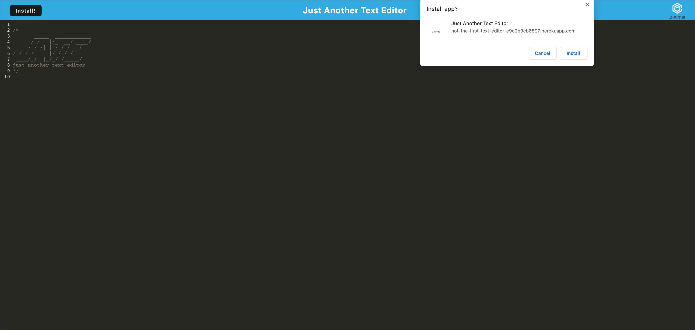
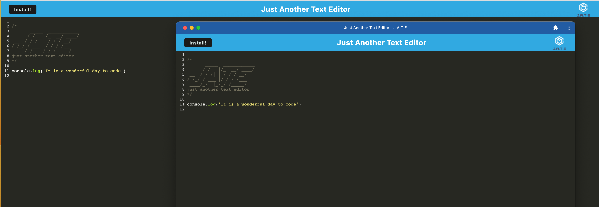
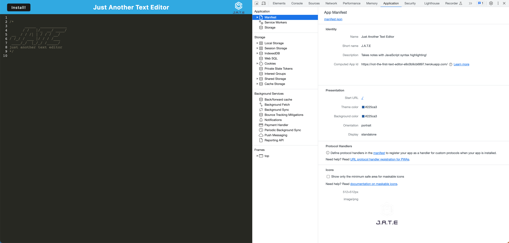
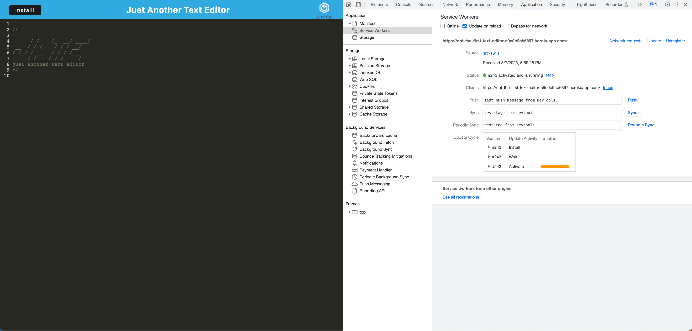
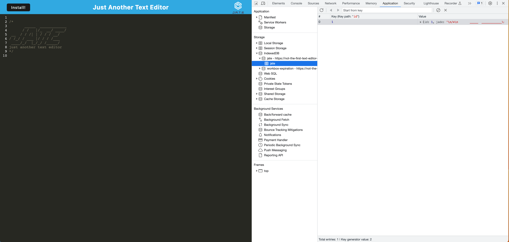

# PWA Text Editor

This Text Editor App is a single page application that meets PWA criteria. It features a number of data persistence techniques that serve as redundancy in case one of the options isn't supported by the browser as well as keeping the application functional when offline. 

## Deployed Application

[PWA Text Editor](https://not-the-first-text-editor-e9c0b9cb6897.herokuapp.com/)

## Application

_Functionality:_

_Manifest.json:_

_Registered Service Worker:_

_IndexedDB Storage:_

